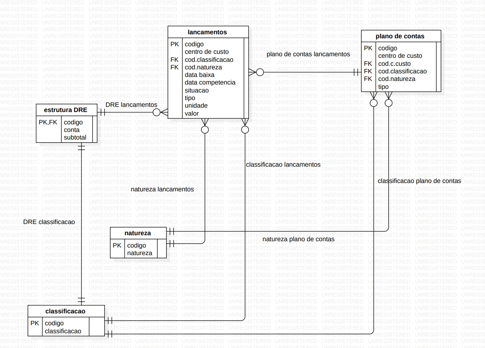
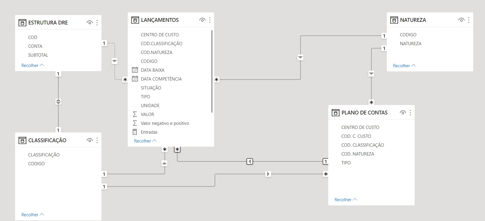
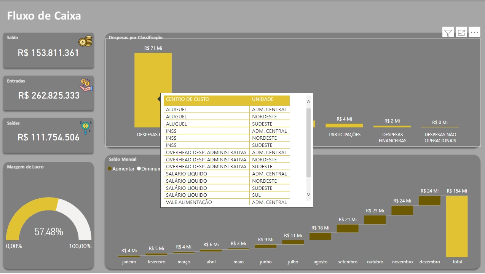

# Fluxo de Caixa e DRE

Case de seleção de estágio em Business Intelligence

Após carregar os dados para o Power BI, eu realizei a modelagem e transformação dos mesmos conforme a necessidade dos requisitos que eu teria que informar no Dashboard.

 

Visualizando relacionamento no Power BI

 

Medidas utilizadas(DAX)

Margem de lucro:
 &nbsp;
```Margem = ([Entradas] - [Saídas]) / [Entradas]```
 &nbsp;

 Entradas:
 &nbsp;
 ```Entradas = CALCULATE(SUM('LANÇAMENTOS'[VALOR]),'LANÇAMENTOS'[TIPO] = "Receber", 'LANÇAMENTOS'[SITUAÇÃO] = "Aberto")```
 &nbsp;

 Saídas:
 &nbsp;
 ```Saídas = CALCULATE(SUM('LANÇAMENTOS'[VALOR]),'LANÇAMENTOS'[TIPO]="Pagar", 'LANÇAMENTOS'[SITUAÇÃO] = "Aberto")```
 &nbsp;
 
 Saldo:
 &nbsp;
 ```Saldo = SUM('LANÇAMENTOS'[Valor negativo e positivo])```

 Tooltip
  

 # Insigths:
 - a maior despesa da empresa é com despesas fixas como aluguel e INSS(em todas as unidades);
 - o saldo mensal aumentou ao longo do ano de 2022;
 - a margem de lucro em 2022 foi de 57%.